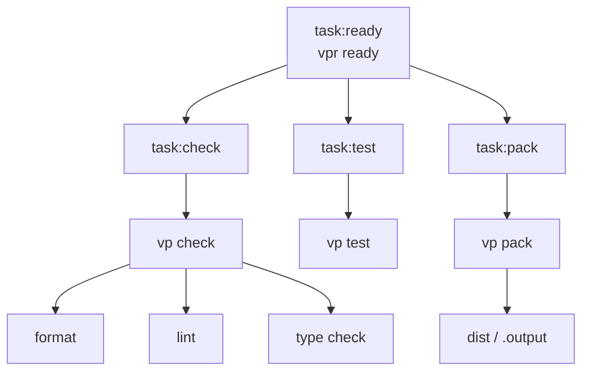

# vp-cli

A TypeScript CLI/package starter built with [Vite+](https://viteplus.dev/guide/), TypeScript, Vitest, OXC linting/formatting, GitHub Actions, GitHub planning templates, and pnpm catalogs.

This template is intentionally minimal. It includes strict TypeScript defaults, Vite+ task orchestration, formatting, linting, testing, CI, GitHub planning templates, and a tiny CLI fixture without adding framework-specific application code.

## Template Setup Checklist

When using this template for a real CLI or package project:

- [ ] Update the root `package.json` name.
- [ ] Update package metadata such as description, repository, license, keywords, and author if needed.
- [ ] Replace the starter `src/index.ts` export.
- [ ] Replace the starter `src/index.test.ts` test.
- [ ] Replace the starter `src/cli` fixture.
- [ ] Decide whether the package should expose library exports, CLI binaries, or both.
- [ ] Add `exports`, `bin`, `files`, and publishing metadata when the package shape is known.
- [ ] Update GitHub workflow names or paths if the project layout changes.
- [ ] Set up GitHub branch protection rules for `main` and require the Ready workflow before merging.
- [ ] Update issue templates if the project needs different planning prompts.
- [ ] Update this README for the real project.
- [ ] Run `vpr fmt`.
- [ ] Run `vpr ready`.

## Stack

- [TypeScript](https://www.typescriptlang.org)
- [Vite+](https://viteplus.dev/guide/)
- [Vitest](https://vitest.dev/guide/)
- [OXC](https://oxc.rs/docs/guide/usage/linter/config.html) linting and formatting through Vite+
- [GitHub Actions](https://docs.github.com/en/actions)
- [GitHub issue forms](https://docs.github.com/en/issues/tracking-your-work-with-issues/configuring-issues/configuring-issue-templates-for-your-repository)
- pnpm catalogs

## Requirements

Use the Node version supported by `package.json`.

CI uses Node 24, so Node 24 is the safest local default.

Install dependencies with Vite+:

```sh
vp install
```

## Creating From This Template

Use this repository as a GitHub template for new TypeScript CLI/package projects.

You can also create a project from this template with Vite+:

```sh
vp create github:blazeshomida/vp-cli
```

After creating a new repository or project from the template, follow the setup checklist above and run:

```sh
vp install
vpr fmt
vpr ready
```

See the [Vite+ create guide](https://viteplus.dev/guide/create) for other template creation options.

## Commands

Vite+ runs package scripts and configured tasks through `vp run`.

The `vpr` command is the shorthand for `vp run`.

```sh
# Run the starter CLI
vpr dev

# Run the starter CLI with an argument
vpr dev -- --name Blaze

# Format files
vpr fmt

# Lint files
vpr lint

# Run format, lint, and type checks
vpr check

# Run tests
vpr test

# Package the project
vpr pack

# Run the full local readiness check
vpr ready
```

Run `vpr fmt` before `vpr ready` when finalizing changes.

## Project Structure

```txt
src/
  cli/
    _args.test.ts
    _args.ts
    _command.ts
    index.ts
  index.test.ts
  index.ts

tooling/
  format.ts
  lint.ts
  patterns.ts
  tasks.ts
  test.ts

.github/
  workflows/
    ready.yml
  ISSUE_TEMPLATE/
    bug_report.yml
    config.yml
    feature_request.yml
    task.yml
  pull_request_template.md

package.json
README.md
vite.config.ts
tsconfig.json
tsconfig.base.json
pnpm-workspace.yaml
```

## Source Layout

The template starts with a tiny library boundary and CLI fixture:

```txt
src/
  cli/
    index.ts
    _args.ts
    _command.ts
    _args.test.ts
  index.ts
  index.test.ts
```

`src/index.ts` is the starter public module boundary.

`src/cli/index.ts` is the starter CLI entrypoint.

`src/cli/_*.ts` files are private implementation files for the CLI vertical.

For a small package, keeping source near the public entrypoint and CLI entrypoint is enough. As the project grows, prefer vertical structure over broad horizontal dumping grounds.

Prefer this shape when commands become meaningful:

```txt
src/
  commands/
    init/
      index.ts
      _schema.ts
      _run.ts
      _run.test.ts
  cli/
    index.ts
    _args.ts
    _command.ts
  index.ts
```

Use `_` prefixes for private implementation details inside a vertical:

```txt
src/
  commands/
    init/
      index.ts
      _args.ts
      _config.ts
      _run.ts
      _run.test.ts
```

Rules:

- `index.ts` files are public boundaries for a vertical.
- `_*.ts` files are private to the vertical.
- `_*/` folders are private implementation folders.
- Do not import from another vertical's `_` files.
- Promote code to shared only after at least two real call sites need it.
- Shared code should have a clear name and ownership.
- Avoid vague dumping grounds like `utils`.
- Keep tests near the code they verify.
- Keep types near the code that owns them unless they are part of the public API.

Reference:

- [The Vertical Codebase](https://tkdodo.eu/blog/the-vertical-codebase)

## TypeScript

The root TypeScript config is strict and package-oriented.

The template uses:

- `target: "ES2022"`
- `lib: ["ES2022"]`
- `module: "ESNext"`
- `moduleResolution: "bundler"`
- `isolatedModules`
- `moduleDetection: "force"`
- `verbatimModuleSyntax`
- `strict`
- `exactOptionalPropertyTypes`
- `noUncheckedIndexedAccess`
- `noImplicitOverride`
- `noPropertyAccessFromIndexSignature`
- `noUnusedLocals`
- `noUnusedParameters`
- `noEmit`

`ES2022` keeps syntax and runtime API assumptions stable. Raise `target` or `lib` only when the package intentionally targets newer runtimes or provides the needed polyfills.

Package-local imports use the `#/` alias:

```ts
import { createGreeting } from "#/index";
```

## Starter CLI

The template includes a small CLI fixture powered by Node's built-in `parseArgs`.

Run the default greeting:

```sh
vpr dev
```

Run a named greeting:

```sh
vpr dev -- --name Blaze
```

The starter command prints:

```txt
Hello, Blaze.
```

This fixture is intentionally small. Replace it with the real command boundary when creating a project from the template.

## Tooling

`vite.config.ts` is the composition point. Focused config lives under `tooling/`:

- `tooling/format.ts` owns formatting config.
- `tooling/lint.ts` owns lint config.
- `tooling/patterns.ts` owns generated and output path patterns.
- `tooling/tasks.ts` owns the Vite+ task graph.
- `tooling/test.ts` owns Vitest config.

### Task Graph



Vite+ provides the local workflow:

- `vp install` installs dependencies using the detected workspace package manager.
- `vpr` is shorthand for `vp run`.
- `vp run` executes package scripts and configured tasks.
- `vp check` runs formatting, linting, and type checking together.
- `vp fmt` formats files.
- `vp lint` lints files.
- `vp test` runs Vitest without staying in watch mode by default.
- `vp pack` packages the project through Vite+.

Relevant docs:

- [Vite+: Getting Started](https://viteplus.dev/guide/)
- [Vite+: Create](https://viteplus.dev/guide/create)
- [Vite+: Installing Dependencies](https://viteplus.dev/guide/install)
- [Vite+: Run](https://viteplus.dev/guide/run)
- [Vite+: Check](https://viteplus.dev/guide/check)
- [Vite+: Format](https://viteplus.dev/guide/fmt)
- [Vite+: Lint](https://viteplus.dev/guide/lint)
- [Vite+: Test](https://viteplus.dev/guide/test)
- [Vite+: Task Caching](https://viteplus.dev/guide/cache)
- [Vite+: IDE Integration](https://viteplus.dev/guide/ide-integration)
- [Vite+: Continuous Integration](https://viteplus.dev/guide/ci)
- [Vite+: Composing Configuration Files](https://viteplus.dev/guide/monorepo#composing-configuration-files)
- [OXC: Linter Configuration](https://oxc.rs/docs/guide/usage/linter/config.html)
- [Vitest: Getting Started](https://vitest.dev/guide/)

## Formatting

Formatting is configured through `tooling/format.ts`.

Import sorting uses a project alias group for imports that start with `#/`:

```ts
import { thing } from "#/thing";
```

Generated files, output directories, and local tool directories are excluded from formatting through shared patterns in `tooling/patterns.ts`.

The formatter also sorts `package.json` scripts.

## Linting

Linting is configured through `tooling/lint.ts`.

The default lint plugins are:

- `eslint`
- `typescript`
- `unicorn`
- `oxc`

The default lint environment is Node-oriented for CLI/package code.

Test files add Vitest-specific rules and globals.

Lint categories are configured as:

- `correctness`: error
- `suspicious`: error
- `perf`: warn

The template also enables type-aware linting and reports unused disable directives as errors.

## Testing

Testing is configured through `tooling/test.ts`.

Tests are matched with:

```txt
src/**/*.test.ts
```

The default reporter is:

```txt
tree
```

The starter tests verify the public package boundary and CLI argument parsing.

Run tests with:

```sh
vpr test
```

## Packaging

The package workflow is exposed through:

```sh
vpr pack
```

The task graph runs:

```sh
vp pack
```

Package output is expected under:

```txt
dist
.output
```

These output directories are excluded from task inputs and tracked as task outputs so cached tasks do not depend on files they generate.

When turning this template into a real package, update `package.json` with the package boundary you need:

- `exports` for library entrypoints
- `bin` for CLI entrypoints
- `files` for publishable files
- `types` if declaration output is generated
- publish configuration if the package will be published

## CI

The Ready workflow runs on pull requests, pushes to `main`, and manual dispatch.

It uses Vite+ to:

1. install dependencies
2. restore the Vite+ task cache and package output
3. run the ready task

Cached paths:

```txt
node_modules/.vite
node_modules/.vite-temp
dist
.output
```

Package output is restored with the task cache because generated output directories are excluded from task inputs.

Local verification should use:

```sh
vpr ready
```

Relevant docs:

- [Vite+: Continuous Integration](https://viteplus.dev/guide/ci)
- [Vite+: Task Caching](https://viteplus.dev/guide/cache)

## GitHub Templates

This repository includes scoped GitHub templates for planning and review:

- `.github/pull_request_template.md`
- `.github/ISSUE_TEMPLATE/bug_report.yml`
- `.github/ISSUE_TEMPLATE/feature_request.yml`
- `.github/ISSUE_TEMPLATE/task.yml`

Use these templates to keep issues and pull requests focused on one concern.

Relevant docs:

- [GitHub: Configuring issue templates](https://docs.github.com/en/issues/tracking-your-work-with-issues/configuring-issues/configuring-issue-templates-for-your-repository)
- [GitHub: About issue and pull request templates](https://docs.github.com/en/communities/using-templates-to-encourage-useful-issues-and-pull-requests)

## Agent Instructions

Repository-specific agent instructions should live in:

```txt
AGENTS.md
```

Use `AGENTS.md` to keep coding agents aligned with this template's boundaries, commands, verification expectations, and release workflow.

## Handbook References

This template follows Blaze's engineering handbook:

- [Handbook](https://github.com/blazeshomida/handbook)
- [Standards](https://github.com/blazeshomida/handbook/tree/main/standards)
- [Templates](https://github.com/blazeshomida/handbook/tree/main/templates)
